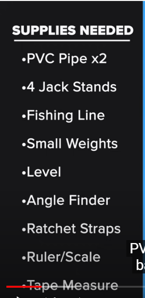

<h2 align="center">BMW 325i E46 M54 ET37</h2>
<!--~~~~~~~~~~~~~~~~~~~~~~~~~~~~~~~~~~~~~~~~~~~~~~~~~~~~~~~~~~~~~~~~~~~~~~~~~~~~~~~~~~~~~~~~~~~~-->
<!--~~~~~~~~~~~~~~~~~~~~~~~~~~~~~~~ readme.md of BMW.bauska.org ~~~~~~~~~~~~~~~~~~~~~~~~~~~~~~~~-->
<h3 align="center">made in South Africa 2/2004</h3>

<!--~~~~~~~~~~~~~~~~~~~~~~~~~~~~~~~~~~~~~~~~~~~~~~~~~~~~~~~~~~~~~~~~~~~~~~~~~~~~~~~~~~~~~~~~~~~~-->
<!--~~~~~~~~~~~~~~~~~~~~~~~~~~~~~~~~~~~~~~~~ BMW logo ~~~~~~~~~~~~~~~~~~~~~~~~~~~~~~~~~~~~~~~~~~-->

<h3>Tools/Parts</h3>
<h4>2-4 lb sledge hammer</h4>
<h4>pickle fork or clutch puller</h4>
<h4>4 replacement bolts</h4>
 
<!--~~~~~~~~~~~~~~~~~~~~~~~~~~~~~~~~~~~~~~~~~~~~~~~~~~~~~~~~~~~~~~~~~~~~~~~~~~~~~~~~~~~~~~~~~~~~-->
<h1>Fix BMW front end</h1>

<h2><b><i>1st</i></b> Outer Tie Rods (Remove & Replace)</h2>
<ul>
  <li><h3><a href="https://www.youtube.com/watch?v=usfbSLE_1aI&t=726s">
    Control Arms, Bushings, Ball Joints, Tie Rods, & End Links</a></h3></li>
  <li><h3><a href="https://www.youtube.com/watch?v=faKhwzbO6H4">A1 Auto directions</a></h3></li>
  <li><h3><a href="https://www.youtube.com/watch?v=75Qt_O5x2M0">50's Kid Tie Rod R & R</a></h3></li>
</ul>

<h2>Lower Control Arms R & R</h2>
<ul>
    <li><h3><a href="https://www.youtube.com/watch?v=e5xaIwkA_oE">Shoplife R & R</a></h3></li>
    <li><h3><a href="https://www.youtube.com/watch?v=5olCf8zpad4">A1 Auto Lower Control Arm Removal & Replacement</a></h3></li>
    <li><h3><a href="https://www.youtube.com/watch?v=aR4UPFbjgnI">50's Guy Lower Control Arm R & R</a></h3></li>
    <li><h3><a href="https://www.youtube.com/watch?v=iQhQu1ZrTno">How to remove & replace Control Arm Bushings</a></h3></li>
</ul>

<h3>Tools Required to Self-Align</h3>
<!--~~~~~~~~~~~~~~~~~~~~~~~~~~~~~~~~~~~~~~~~~~~~~~~~~~~~~~~~~~~~~~~~~~~~~~~~~~~~~~~~~~~~~~~~~~~~-->
<!--~~~~~~~~~~~~~~~~~~~~~~~~~~~~~~ tools for front-end alignment ~~~~~~~~~~~~~~~~~~~~~~~~~~~~~~~-->

  

[**Jump to TOC**](#bmw-toc)  

https://github.com/bbauska/bmw-blog.git

<a href="https://thetrackahead.com/projects/bmw-e46/how-to-change-cabin-air-filter-bmw-e46-3-series/">Air Filter R & R</a>

<h2><a id="bmw-toc">Table of Contents</h2>

 1.  [BMW Components {anatomy}](#bmw-anatomy)
 2.  [Intake & Exhaust Camshaft Position Sensors](#bmw-cam-sensor)
 3.  [Parts & Tools Needed](#bmw-parts)
 4.  [BMW Engine](#11-engine)
 5.  [Engine Electrical](#12-engine-elec)
 6.  [CCV](#bmw-ccv)
 7.  [Fuel Preparation System](#13-fuel-preparation)
 8.  [Fuel System](#16-fuel-supply)
 9.  [Radiator](#17-radiator)
10.  [Exhaust System](#18-exhaust)
11.  [Clutch](#21-clutch)
12.  [Engine & Transmission Suspension](#22-eng-tran-suspension)
13.  [Manual Transmission](#23-manual-transmission)
14.  [Automatic Transmission](#24-automatic-transmission)
15.  [Gearshift](#25-gearshift)
16.  [Drive Shaft](#26-drive-shaft)

<h1> 17.  <a href="#31-front-axle">Front Axle/Wishbone Suspension</a></h1>
 
18.  [Steering](#32-steering)
19.  [Rear Axle](#33-rear-axle)
20.  [Brakes](#34-brakes)
21.  [Pedals](#35-pedals)
22.  [Wheels](#36-wheels)
23.  [Body Work](#41-bodywork)
24.  [Vehicle Trim](#51-vehicle-trim)
25.  [Seats](#52-seats)
26.  [Sliding Roof/Folding Top](#54-sliding-roof)
27.  [Vehicle Electrical System](#61-vehicle-electrical)
28.  [Instruments](#62-instruments)
29.  [Lighting](#63-lighting)
30.  [Heater and Air Conditioning](#64-heater-air)
31.  [Individual Equipment](#91-ind-equipment)

<h2>External links</h2>

   <b><a href="#bmw-toc">↥ Back To Top</a></b>

<h2>More work to do or done:</h2>

<h2><a id="bmw-anatomy">BMW Anatomy</h2>
<!--~~~~~~~~~~~~~~~~~~~~~~~~~~~~~~~~~~~~~~~~~~~~~~~~~~~~~~~~~~~~~~~~~~~~~~~~~~~~~~~~~~~~~~~~~~~~-->
<!--~~~~~~~~~~~~~~~~~~~~~~~~~~~~~~~~~~~~~~~ BMW anatomy ~~~~~~~~~~~~~~~~~~~~~~~~~~~~~~~~~~~~~~~~-->

   <b><a href="#bmw-toc">↥ Back To Top</a></b>

<!--~~~~~~~~~~~~~~~~~~~~~~~~~~~~~~~~~~~~~~~~~~~~~~~~~~~~~~~~~~~~~~~~~~~~~~~~~~~~~~~~~~~~~~~~~~~~-->
<!--~~~~~~~~~~~~~~~~~~~~~~~~~~~~~~~~~~~ BMW camshaft sensor ~~~~~~~~~~~~~~~~~~~~~~~~~~~~~~~~~~~~-->

<h2><a id="bmw-cam-sensor">BMW Camshaft (Intake & Exhaust) Sensors</h2>

   <b><a href="#bmw-toc">↥ Back To Top</a></b>

[How to Replace Front Suspension (video)](#bmw-front-suspension)

<!--~~~~~~~~~~~~~~~~~~~~~~~~~~~~~~~~~~~~~~~~~~~~~~~~~~~~~~~~~~~~~~~~~~~~~~~~~~~~~~~~~~~~~~~~~~~~-->
<!--~~~~~~~~~~~~~~~~~~~~~~~~~~~~~~~~~~~~~~ BMW camshaft ~~~~~~~~~~~~~~~~~~~~~~~~~~~~~~~~~~~~~~~~-->

[Sun/Moon Roof {remove & repair}](#bmw-sunroof)

*   [Shade Clip Remove & Repair](#bmw-sunroof-shade-clip)
*   [More Sun/Moon Roof](#bmw-sunroof-etc)

[Replacing Fluids {Tran/Axle/Engine/Steering/Cooling System}](#bmw-fluids)

<!--~~~~~~~~~~~~~~~~~~~~~~~~~~~~~~~~~~~~~~~~~~~~~~~~~~~~~~~~~~~~~~~~~~~~~~~~~~~~~~~~~~~~~~~~~~~~-->
<!--~~~~~~~~~~~~~~~~~~~~~~~~~~~~~~~~~~~~ replacing fluids ~~~~~~~~~~~~~~~~~~~~~~~~~~~~~~~~~~~~~~-->

[Expert Tips, Tricks, & Techniques](#bmw-expert)

<!--~~~~~~~~~~~~~~~~~~~~~~~~~~~~~~~~~~~~~~~~~~~~~~~~~~~~~~~~~~~~~~~~~~~~~~~~~~~~~~~~~~~~~~~~~~~~-->
<!--~~~~~~~~~~~~~~~~~~~~~~~~~~~~~~~~~~~~~~~~~ wheelhouse ~~~~~~~~~~~~~~~~~~~~~~~~~~~~~~~~~~~~~~~-->

[Wheelhouse](#wheelhouse)

<!--~~~~~~~~~~~~~~~~~~~~~~~~~~~~~~~~~~~~~~~~~~~~~~~~~~~~~~~~~~~~~~~~~~~~~~~~~~~~~~~~~~~~~~~~~~~~-->
<!--~~~~~~~~~~~~~~~~~~~~~~~~~~~~~~~~~~~~~~~~~ disa valve ~~~~~~~~~~~~~~~~~~~~~~~~~~~~~~~~~~~~~~~-->

[DISA Valve](#disa)

<!--~~~~~~~~~~~~~~~~~~~~~~~~~~~~~~~~~~~~~~~~~~~~~~~~~~~~~~~~~~~~~~~~~~~~~~~~~~~~~~~~~~~~~~~~~~~~-->
<!--~~~~~~~~~~~~~~~~~~~~~~~~~~~~~~~~~~~~~~~ parts & tools ~~~~~~~~~~~~~~~~~~~~~~~~~~~~~~~~~~~~~~-->

   <b><a href="#bmw-toc">↥ Back To Top</a></b>

<h2><a id="bmw-parts">Parts & Tools</h2>

[Parts & Tools](#bmw-parts)
<!--~~~~~~~~~~~~~~~~~~~~~~~~~~~~~~~~~~~~~~~~~~~~~~~~~~~~~~~~~~~~~~~~~~~~~~~~~~~~~~~~~~~~~~~~~~~~-->
<!--~~~~~~~~~~~~~~~~~~~~~~~~~~~~~~~~~~~~~ 11-bmw--engine ~~~~~~~~~~~~~~~~~~~~~~~~~~~~~~~~~~~~~~~-->
<h2><a id="11-engine">BMW Engine</h2>

   <b><a href="#bmw-toc">↥ Back To Top</a></b>

   <b><a href="#bmw-toc">↥ Back To Top</a></b>

<h2>Sun/Moon Roof (R & R)</h2>
<!--~~~~~~~~~~~~~~~~~~~~~~~~~~~~~~~~~~~~~~~~~~~~~~~~~~~~~~~~~~~~~~~~~~~~~~~~~~~~~~~~~~~~~~~~~~~~-->
<!--~~~~~~~~~~~~~~~~~~~~~~~~~~~~~~~~~~~~~~~ sun/moon roof ~~~~~~~~~~~~~~~~~~~~~~~~~~~~~~~~~~~~~~-->
<h2><a id="bmw-sunroof">Sun/Moon Roof Remove & Repair</h2>

<h2><a id="bmw-sunroof-shade-clip">Shade Clip Remove & Repair</h2>
<h2><a id="bmw-sunroof-etc">More Sun/Moon Roof</h2>

   <b><a href="#bmw-toc">↥ Back To Top</a></b>

<h3>Front Axle Support / Wishbone</h3>
<!--~~~~~~~~~~~~~~~~~~~~~~~~~~~~~~~~~~~~~~~~~~~~~~~~~~~~~~~~~~~~~~~~~~~~~~~~~~~~~~~~~~~~~~~~~~~~-->
<!--------------------------------- 17. front axle/wishbone suspensio -------------------------------->
<h3><a id="31-front-axle">Front Axle/Suspension</h3>
 

Front Suspension w/parts list 
<a href="https://www.realoem.com/bmw/enUS/showparts?id=ET37-USA-02-2004-E46-BMW-325i&diagId=31_0600">click here</a>

&nbsp;
&nbsp;
 

OEM Front Suspension w/parts list 
<a href="https://www.estore-central.com/bmw-parts-catalog/E46-325i-M54/Sedan/Front-Axle/Front-Axle-Support-Wishbone-2/">
click here</a>

   <b><a href="#bmw-toc">↥ Back To Top</a></b>

Front Axle Stabilizer Bar 
<a href="https://www.estore-central.com/bmw-parts-catalog/E46-325i-M54/Sedan/Front-Axle/Stabilizer-Front/">
Click here</a>

 
<h4>Parts is parts</h4>

<h4>Control arms and bushings, ball joints, tie rods, and stabilizer end links for a more 
complete front suspension rebuild</h4>

<!--~~~~~~~~~~~~~~~~~~~~~~~~~~~~~~~~~~~~~~~~~~~~~~~~~~~~~~~~~~~~~~~~~~~~~~~~~~~~~~~~~~~~~~~~~~~~-->
<!--~~~~~~~~~~~~~~~~~~~~~~~~~~~~~~~~~~~~ wishbone suspension ~~~~~~~~~~~~~~~~~~~~~~~~~~~~~~~~~~~-->

   <b><a href="#bmw-toc">↥ Back To Top</a></b>

<h3>Expansion Tank / Radiator</h3>
<!--~~~~~~~~~~~~~~~~~~~~~~~~~~~~~~~~~~~~~~~~~~~~~~~~~~~~~~~~~~~~~~~~~~~~~~~~~~~~~~~~~~~~~~~~~~~~-->
<!--~~~~~~~~~~~~~~~~~~~~~~~~~~~~~~~~~~~~ bmw expansion tank ~~~~~~~~~~~~~~~~~~~~~~~~~~~~~~~~~~~~-->

<a href="https://github.com/bbauska/BMW-Blog/blob/main/images/17-radiator/05-radiator/17.05-Expansion-Tank-Standard-Transmission.png?raw=true">
  title="BMW Expansion Tank"
  alt="BMW Expansion Tank."
  width="50%" /></a>

   <b><a href="#bmw-toc">↥ Back To Top</a></b>

<!--~~~~~~~~~~~~~~~~~~~~~~~~~~~~~~~~~~~~~~~~~~~~~~~~~~~~~~~~~~~~~~~~~~~~~~~~~~~~~~~~~~~~~~~~~~~~-->
<!--~~~~~~~~~~~~~~~~~~~~~~~~ 17-radiator - cooling system water hoses ~~~~~~~~~~~~~~~~~~~~~~~~~~-->
<h3>Front body bracket (left & right)</h3>

   <b><a href="#bmw-toc">↥ Back To Top</a></b>

<!--~~~~~~~~~~~~~~~~~~~~~~~~~~~~~~~~~~~~~~~~~~~~~~~~~~~~~~~~~~~~~~~~~~~~~~~~~~~~~~~~~~~~~~~~~~~~-->
<!--~~~~~~~~~~~~~~~~~~~~~~~~~ cooling system - radiator & water hoses ~~~~~~~~~~~~~~~~~~~~~~~~~~-->
<h2><a id="17-radiator">Cooling System</h2>

   <b><a href="#bmw-toc">↥ Back To Top</a></b>

[]
[]

<!--~~~~~~~~~~~~~~~~~~~~~~~~~~~~~~~~~~~~~~~~~~~~~~~~~~~~~~~~~~~~~~~~~~~~~~~~~~~~~~~~~~~~~~~~~~~~-->
<!--~~~~~~~~~~~~~~~~~~~~~~~~~~~~~~~~~~~~~ rear wheelhouse ~~~~~~~~~~~~~~~~~~~~~~~~~~~~~~~~~~~~~~-->
<h2>Rear Wheelhouse</h2>

<h2><a id="rear-wheelhouse">Rear Wheelhouse</h2>

<!--~~~~~~~~~~~~~~~~~~~~~~~~~~~~~~~~~~~~~~~~~~~~~~~~~~~~~~~~~~~~~~~~~~~~~~~~~~~~~~~~~~~~~~~~~~~~-->
<!--~~~~~~~~~~~~~~~~~~~~~~~~~~~~~~~~~~~~~~~ Microfilter ~~~~~~~~~~~~~~~~~~~~~~~~~~~~~~~~~~~~~~~~-->
<h2>Microfilter</h2>

[**`^        back to top        ^`**](#bmw-toc)

<!--~~~~~~~~~~~~~~~~~~~~~~~~~~~~~~~~~~~~~~~~~~~~~~~~~~~~~~~~~~~~~~~~~~~~~~~~~~~~~~~~~~~~~~~~~~~~-->
<!--~~~~~~~~~~~~~~~~~~~~~~~~~~~~~~~~ Fuel Tank Attaching Parts ~~~~~~~~~~~~~~~~~~~~~~~~~~~~~~~~~-->
<h2>Fuel Tank Attaching Parts</h2>
<h2><a id="13-fuel-preparation">Fuel Tank Attaching Parts</h2>

<a href="https://github.com/bbauska/BMW-Blog/blob/main/images/16-fuel-supply/05-fuel-tank/16.05%20Fuel%20Tank%20Attaching%20Parts.png?raw=true">Fuel Tank Attaching Parts</a>

   <b><a href="#bmw-toc">↥ Back To Top</a></b>

<!--~~~~~~~~~~~~~~~~~~~~~~~~~~~~~~~~~~~~~~~~~~~~~~~~~~~~~~~~~~~~~~~~~~~~~~~~~~~~~~~~~~~~~~~~~~~~-->
<!--~~~~~~~~~~~~~~~~~~~~~~~~~~~~~~~~~~~~~~~~~~~~~~~~~~~~~~~~~~~~~~~~~~~~~~~~~~~~~~~~~~~~~~~~~~~~-->

   <b><a href="#bmw-toc">↥ Back To Top</a></b>

<!--~~~~~~~~~~~~~~~~~~~~~~~~~~~~~~~~~~~~~~~~~~~~~~~~~~~~~~~~~~~~~~~~~~~~~~~~~~~~~~~~~~~~~~~~~~~~-->
<!--~~~~~~~~~~~~~~~~~~~~~~~~~~~~~~~ suspension remove & replace ~~~~~~~~~~~~~~~~~~~~~~~~~~~~~~~~-->
<h2>BMW Suspension Replace</h2>

<h4="bmw-front-suspension">BMW Suspension Replace

https://youtu.be/ytN-tYiS9HE

How to remove and replace your steering tie rod(s) and lower control arm(s) in an e46 BMW 
Sport. See my note below on sourcing your parts.  If your BMW's front end is clunking when 
you hit the brakes or your car  wanders on uneven pavement, it's usually your lower control 
arm ball joints (built into the lower control arm) or your control arm bushing.  Under 
normal driving conditions you should replace the lower control arm bushing every 60k miles 
and the entire control arm and bushing as a set every 120k miles. I also replace the 
steering tie rods because you are already in the area and it provides better clearance to 
remove the lower control arms. Check your tires because if your front suspension has 
degraded, you probably are experiencing uneven wear in the tires.  Always wear safety 
glasses or goggles and gloves for protection. Always get a proper alignment soon after 
this procedure. Note that the BMW front suspension is a rather complicated design, if you 
have higher mileage on your car it's best to rebuild the entire front end instead of 
piecemealing the replacement parts as another part may be worn or near its life expectancy 
and you may chase a problem for many miles.  This is where ownership costs rise in European 
vehicles.

After hearing from other BMW owners, the part brand recommended would NOT be Deutche 
Parts, but Lemforder, Meyle, Febi, and maybe Karlyn.  The Lemforder and Meyle are more 
OEM related and have proven to be superior steering/suspension hardware in the 
aftermarket world.  These parts were eventually changed out (again) due to poor quality 
and I replaced with OEM dealer parts and they've held up quite well (over 50k miles) and 
working great.  It's always good to change out the control arm bushings (pivot ones 
towards the back) at least every 50-60k miles to keep things tight.  Use this video 
just for procedure purposes, buy the best parts you can afford.

   <b><a href="#bmw-toc">↥ Back To Top</a></b>

<!--~~~~~~~~~~~~~~~~~~~~~~~~~~~~~~~~~~~~~~~~~~~~~~~~~~~~~~~~~~~~~~~~~~~~~~~~~~~~~~~~~~~~~~~~~~~~-->
<!--~~~~~~~~~~~~~~~~~~~~~~~~~~~~~~~~~~~~~~~ master key ~~~~~~~~~~~~~~~~~~~~~~~~~~~~~~~~~~~~~~~~~-->
<h2 id="master-key">Master Key</h2>

   <b><a href="#bmw-toc">↥ Back To Top</a></b>

<!--~~~~~~~~~~~~~~~~~~~~~~~~~~~~~~~~~~~~~~~~~~~~~~~~~~~~~~~~~~~~~~~~~~~~~~~~~~~~~~~~~~~~~~~~~~~~-->
<!--~~~~~~~~~~~~~~~~~~~~~~~~~~~~~~~~~~~~ front side panel ~~~~~~~~~~~~~~~~~~~~~~~~~~~~~~~~~~~~~~-->
<h2>Front Side Panel</h2>

   <b><a href="#bmw-toc">↥ Back To Top</a></b>

<!--~~~~~~~~~~~~~~~~~~~~~~~~~~~~~~~~~~~~~~~~~~~~~~~~~~~~~~~~~~~~~~~~~~~~~~~~~~~~~~~~~~~~~~~~~~~~-->
<!--~~~~~~~~~~~~~~~~~~~~~~~~~~~~~~~~~~~~ front wheelhouse ~~~~~~~~~~~~~~~~~~~~~~~~~~~~~~~~~~~~~~-->
<h2>Front Wheelhouse</h2>

   <b><a href="#bmw-toc">↥ Back To Top</a></b>

<!--~~~~~~~~~~~~~~~~~~~~~~~~~~~~~~~~~~~~~~~~~~~~~~~~~~~~~~~~~~~~~~~~~~~~~~~~~~~~~~~~~~~~~~~~~~~~-->
<!--~~~~~~~~~~~~~~~~~~~~~~~~~~~~~~~~~ rear wheelhouse ~~~~~~~~~~~~~~~~~~~~~~~~~~~~~~~~~~~~~~~~~~-->
<h2>Service history for 2004 bmw 325i e46 with m54 v6</h2>

   <b><a href="#bmw-toc">↥ Back To Top</a></b>

<!--~~~~~~~~~~~~~~~~~~~~~~~~~~~~~~~~~~~~~~~~~~~~~~~~~~~~~~~~~~~~~~~~~~~~~~~~~~~~~~~~~~~~~~~~~~~~-->
<!--~~~~~~~~~~~~~~~~~~~~~~~~~~~~~~~~~~ Exterior Trim & Grill ~~~~~~~~~~~~~~~~~~~~~~~~~~~~~~~~~~~-->
<h2>Exterior Trim & Grill</h2>

   <b><a href="#bmw-toc">↥ Back To Top</a></b>

<!--~~~~~~~~~~~~~~~~~~~~~~~~~~~~~~~~~~~~~~~~~~~~~~~~~~~~~~~~~~~~~~~~~~~~~~~~~~~~~~~~~~~~~~~~~~~~-->
<!--~~~~~~~~~~~~~~~~~~~~~~~~~~~~~~~~~~~~~ External Links ~~~~~~~~~~~~~~~~~~~~~~~~~~~~~~~~~~~~~~~-->
<h2>External links</h2>

   <b><a href="#bmw-toc">↥ Back To Top</a></b>

<!--~~~~~~~~~~~~~~~~~~~~~~~~~~~~~~~~~~~~~~~~~~~~~~~~~~~~~~~~~~~~~~~~~~~~~~~~~~~~~~~~~~~~~~~~~~~~-->
<!--~~~~~~~~~~~~~~~~~~~~~~~~~~~~~~~~~~~~ Awesome Big Data ~~~~~~~~~~~~~~~~~~~~~~~~~~~~~~~~~~~~~~-->
<a href="https://github.com/onurakpolat/awesome-bigdata">
Awesome Big Data</a> - Curated list of awesome big data frameworks, resources and other awesomeness.

[**`^        back to top        ^`**](#bmw-toc)

   <b><a href="#bmw-toc">↥ Back To Top</a></b>

Fuse 9 and 32 were fine, and Fuse 106 and 107 which are 50 Amps. The two big fuses are 
located on the back of the fusebox (How do I get to the back of the fusebox?) If when 
looking at the fuses as your pull them down in your glove box I have 3- 50 amp fuses 
and they are all fine.
